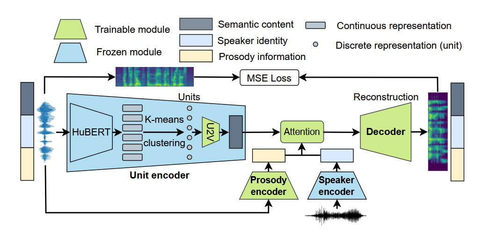
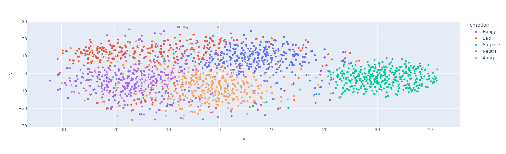

# Prosody2Vec

This repository contains code for training and inference of a multi-speaker and single-speaker speech synthesis model using Prosody2Vec.
The repo is conceptually based on https://arxiv.org/pdf/2212.06972 Paper and enhances it with multi-speaker prosody conversion.




https://colab.research.google.com/drive/1-20CwDeTi5TVSL-op1NZd41SrqMGM6zA#scrollTo=l7Lh_6LjmPCk


## Table of Contents

- [Installation](#installation)
- [Usage](#usage)
  - [Training](#training)
    - [Multi-Speaker Training](#multi-speaker-training)
    - [Single-Speaker Training](#single-speaker-training)
    - [Multi-Speaker Pretraining](#multi-speaker-pretraining)
  - [Inference](#inference)
- [Dataset Preparation](#dataset-preparation)
- [Model Architecture](#model-architecture)
- [Acknowledgements](#acknowledgements)

## Installation

1. Clone the repository:

   ```sh
   git clone https://github.com/yourusername/Prosody2Vec.git
   cd Prosody2Vec
   ```
2. Install the required dependencies:

   ```sh
   pip install -r requirements.txt
   ```

## Dataset Preparation

1. Place your dataset in the `Emotion Speech Dataset` directory.
2. Ensure the dataset is organized in subdirectories for each emotion and speaker.

## Model Architecture

The models use a combination of pre-trained models from https://github.com/bshall/acoustic-model/releases/tag/v0.1 and custom layers for speech synthesis. The main components include:

- **Encoder**: Extracts features from the input speech.
- **Decoder**: Generates the output speech from the encoded features.
- **Fusion Layers**: Combine features from different sources (e.g., emotion vectors, speaker vectors).

## Acknowledgements

This project uses pre-trained models from the following repositories:

- [bshall/acoustic-model](https://github.com/bshall/acoustic-model)
- [bshall/hubert](https://github.com/bshall/hubert)
- [bshall/hifigan](https://github.com/bshall/hifigan)
- [speechbrain/spkrec-ecapa-voxceleb](https://github.com/speechbrain/speechbrain)

We thank the authors of these repositories for their contributions to the community.

# Prosody vector TSNE



s
